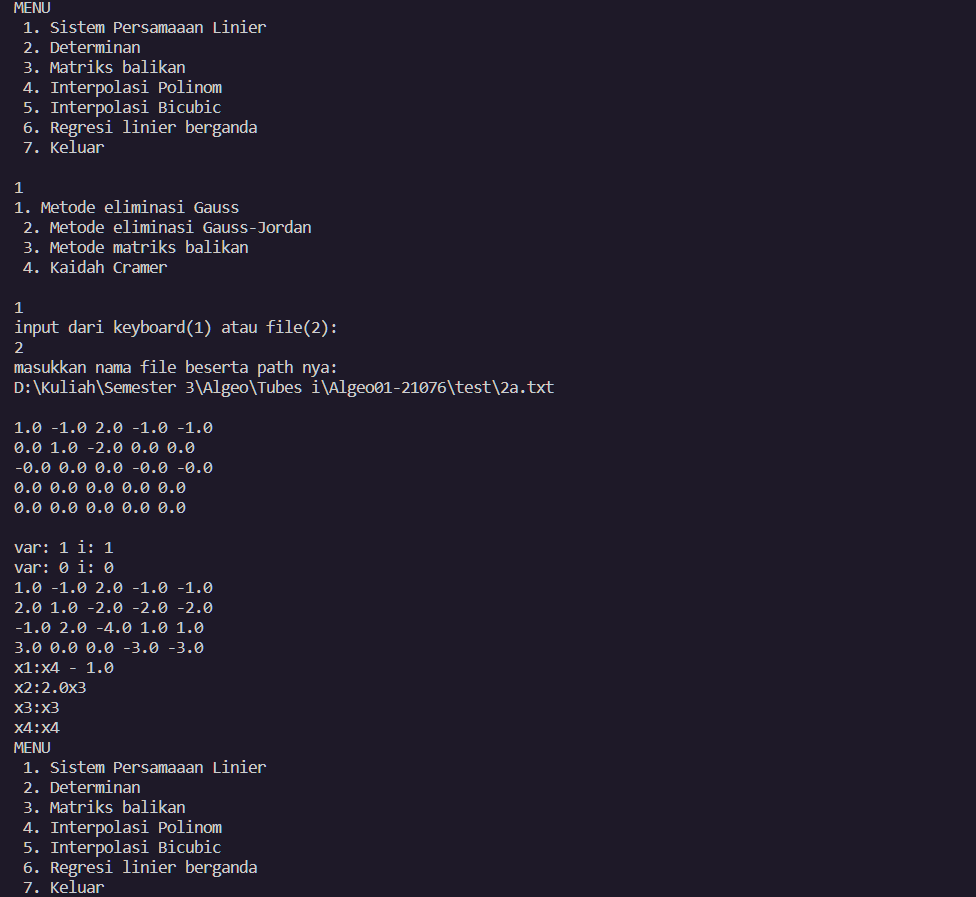

## A program by Lele (Group 14)
### Contributors
- Moh. Aghna Maysan Abyan (13521076)
- Haidar Hamda (13521105)
- Reza Pahlevi Ubaidillah (13521165)

### Usage
- Simply run the `Main.java`
- Choose any options from the Menu
- Let's say I want to find the solution to the `2a.txt` test case. Choose option 1.
- Any of the method will do, but `1. Metode eliminasi Gauss` and `2. Metode eliminasi Gauss-Jordan` are the only one that is parametric compatible. I don't know whether the test case is parametric or not. Just to be safe, I'll choose `1. Metode eliminasi Gauss`
- Well, I want to load the input from `2a.txt`, so choose the second option
- Now the program is asking for the file path, uh I'm tired, fine I'll give them what they want, just stop bothering me
- Finally, the results are here T_T

